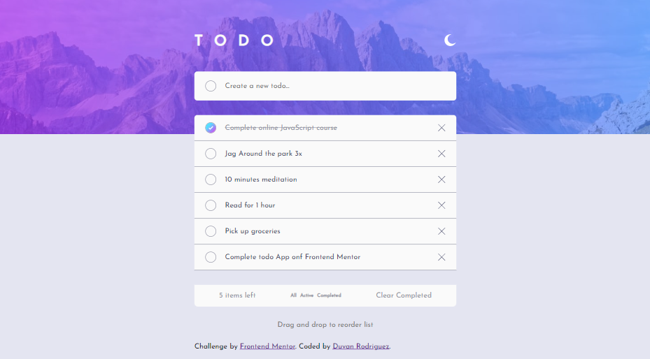

# Frontend Mentor - Todo app


  <h3>
    <a href="http://notepaddevk.s3-website-us-east-1.amazonaws.com/">
      Preview Site
    </a>
  </h3>

## Welcome! 👋


## The challenge

Your challenge is to build out this todo app and get it looking as close to the design as possible.

You can use any tools you like to help you complete the challenge. So if you've got something you'd like to practice, feel free to give it a go.

Your users should be able to:

- View the optimal layout for the app depending on their device's screen size
- See hover states for all interactive elements on the page
- Add new todos to the list
- Mark todos as complete
- Delete todos from the list
- Filter by all/active/complete todos
- Clear all completed todos
- Toggle light and dark mode
- **Bonus**: Drag and drop to reorder items on the list

# Frontend Mentor - Todo app solution

## Table of contents

- [Overview](#overview)
  - [The challenge](#the-challenge)
  - [Screenshot](#screenshot)
  - [Links](#links)
- [My process](#my-process)
  - [Built with](#built-with)
  - [What I learned](#what-i-learned)
  - [Continued development](#continued-development)
  - [Useful resources](#useful-resources)
- [Author](#author)
- [Acknowledgments](#acknowledgments)


## Overview

### The challenge

Users should be able to:

- View the optimal layout for the app depending on their device's screen size
- See hover states for all interactive elements on the page
- Add new todos to the list
- Mark todos as complete
- Delete todos from the list
- Filter by all/active/complete todos
- Clear all completed todos
- Toggle light and dark mode

### Screenshot




### Links

- Solution URL: [Vercel](https://tk-devk-github-io.vercel.app/)
- Live Site URL: [GitHub Pages](https://tkdevk.github.io/Front-end-Challenges/todo-app-main/todo/)

## My process

### Built with

- Semantic HTML5 markup
- CSS custom properties
- Flexbox
- [React](https://reactjs.org/) - JS library
- [Next.js](https://nextjs.org/) - React framework

### What I learned

It's better to design first the father-children logic before start coding, i had several issues trying to pass functions through props, also you can level up your states through props so is pretty interesting how you can just pass everything

GitHub pages is a tricky way to deploy your project, i had an issue related with the source of the Js and Css archive, the solution it's just add a . before the source path and that it's all.
```html
<script type="module" crossorigin src="./assets/index-VrgCtCbo.js"></script>
    <link rel="stylesheet" crossorigin href="./assets/index-hFi5bspx.css"></h1>
```
I keep working with css vanilla, i've trying to work with bootstrap or tailwind but i will stick to css for a while.

```css
8:hover {
  color: var(--generalColor);
}
```
I'm using alot the ternary operator 
```React
const [checkClick, setCheckClick] = useState(false)

```
I'm still learning about the pseudo classes, i think that i'm improving my css skills

I can also build my project to send it to production only using two codes

`npm install -g yarn`

`yarn run build`

This will create a `/dist` folder that for some reason server options like vercel o github pages doesn't recognized, so i had to create a new folder call todo and paste everything there


### Continued development

I will keep learning about context, i tried to use context for the theme component so i can do the toggle but i didn't work for me, i was reading the concept and when i tried to apply it it didn't work, so i had to do it the way that i know and usually use.(DOM manipulation).

### Useful resources

- [React Context](https://react.dev/learn/scaling-up-with-reducer-and-context) - This helped me for XYZ reason. I really liked this pattern and will use it going forward.
- [React useEffect](https://react.dev/reference/react/useEffect) - This is an amazing article which helped me finally understand XYZ. I'd recommend it to anyone still learning this concept.

## Author

- GitHub - [TkDevk](https://github.com/TkDevk)
